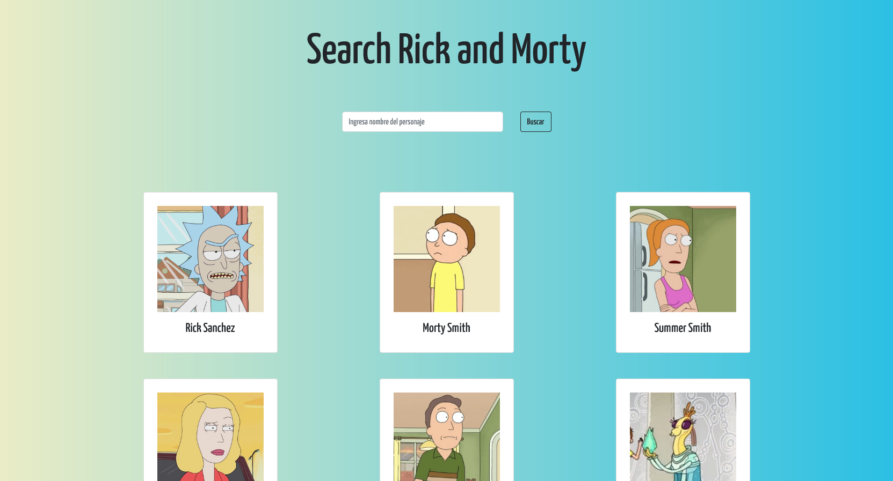

# Search characters "Rick and Morty"



## This project was generated with Vue.js

## Project setup

```
npm install
```

### Compiles and hot-reloads for development

```
npm run serve
```

### Compiles and minifies for production

```
npm run build
```

### Rickandmorty API:

https://rickandmortyapi.com/
